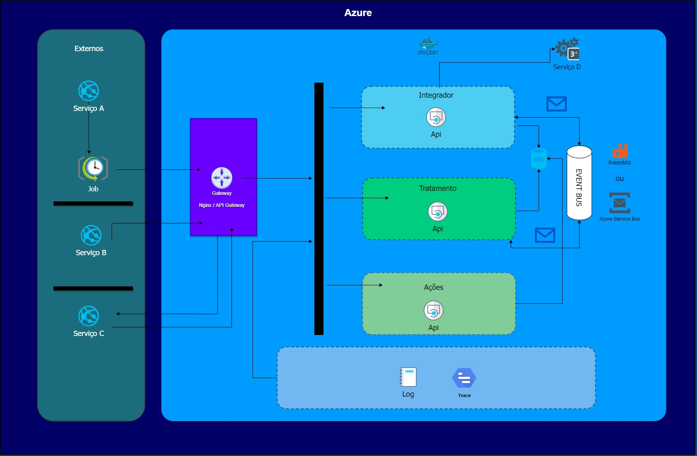

# Projeto integrador - Coletor Automático POC - Prova de conceito

## Objetivo
Coletar dados da integração com serviço externo.

## Arquitetura
Microserviços com implementação de padrão CQRS e Event Sourcing, utilizando service bus Masstransit e serviço de mensageria RabbitMQ.
Logs com Elastic/Kibana. Containers apenas nos serviços.

## Desenho

